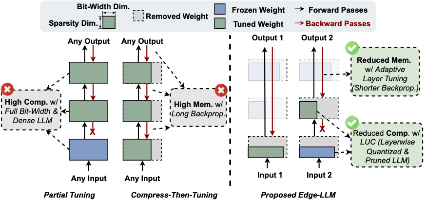

# EDGE-LLM: Enabling Efficient Large Language Model Adaptation on Edge Devices via Layerwise Unified Compression and Adaptive Layer Tuning and Voting

[](https://opensource.org/licenses/Apache-2.0)

Zhongzhi Yu<sup>1</sup>, Zheng Wang<sup>1</sup>, Yuhan Li<sup>1</sup>, Haoran You<sup>1</sup>, Ruijie Gao<sup>1</sup>, Xiaoya Zhou<sup>3</sup>, Sreenidhi Reedy Bommu<sup>1</sup>, Yang (Katie) Zhao<sup>2</sup>, Yingyan (Celine) Lin<sup>1</sup>

*<sup>1</sup> Georgia Institute of Technology, *<sup>2</sup> University of Minnesota, Twin Cities*, *<sup>3</sup> University of California, Santa Barbara**

Accepted by **[DAC 2024](https://61dac.conference-program.com/)**

The official implementation of "Edge-LLM:  Enabling Efficient Large Language Model Adaptation on Edge Devices via Layerwise Unified Compression and Adaptive Layer Tuning and Voting".


## Overview
We introduce a computation- and memory-efficient LLM tuning framework, called Edge-LLM, to facilitate affordable and effective LLM adaptation on edge devices. Specifically, Edge-LLM features three core components: (1) a layer-wise unified compression (LUC) technique to reduce the computation overhead by generating layer-wise pruning sparsity and quantization bit-width policies, (2) an adaptive layer tuning and voting scheme to reduce the memory overhead by reducing the backpropagation depth, and (3) a complementary hardware scheduling strategy to handle the irregular computation patterns introduced by LUC and adaptive layer tuning, thereby achieving efficient computation and data movements. 

  

## Training and Evaluation

### Layerwise Unified Compressed and Adaptive Layer Tuning
To launch the training of the whole Edge-LLM algorithm, please use the following command: 

``` bash
bash ./scripts/edge_llm_train.sh
```

We also provide the script to run each enablers of our proposed framework below 

### Quantize Model
In our implementation, we build our quantization mmethod on top of [LLM-QAT](https://github.com/facebookresearch/LLM-QAT). To try our proposed layer-wise pruning technique to prune the model, please use the following command to quantize and tune the model: 

``` bash
bash ./scripts/layer_wise_quantization.sh
```

### Prune Model
In our implementation, we build our pruning method on top of  [SparseGPT](https://github.com/IST-DASLab/sparsegpt). To only use our proposed layer-wise pruning technique to prune the model, please use the following command to prune and tune the model: 

``` bash
bash ./scripts/layer_wise_pruning.sh
```

### Layerwise Unified Compressed Model
To test the model performance with only the layer-wise unified compression, please use the following command to compress and tune the model: 

``` bash
bash ./scripts/layer_wise_pruning_quantization.sh
```


## Citation
```bibtex
@article{edge_llm,
  title={Edge-LLM:  Enabling Efficient Large Language Model Adaptation on Edge Devices via Layerwise Unified Compression and Adaptive Layer Tuning & Voting},
  author={Zhongzhi Yu, Zheng Wang, Yuhan Li, Haoran You, Ruijie Gao, Xiaoya Zhou, Sreenidhi Reedy Bommu, Yang (Katie) Zhao, Yingyan (Celine) Lin},
  booktitle={61st ACM/IEEE Design Automation Conference (DAC ’24)},
  year={2024}
}
```
